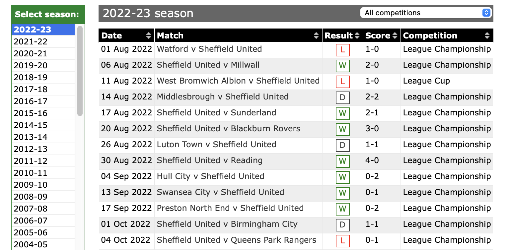
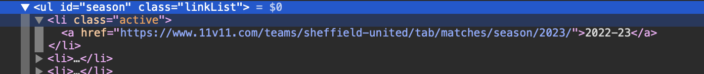

Title: Web Scraping with F#
Published: 2023-03-28
Tags: 
    - F#
    - Web Scraping
    - .NET

---

Inspired by this [post]("https://www.compositional-it.com/news-blog/web-scraping-with-f/") by Dragos at Compositional IT, I thought I'd write about my experience doing web scraping with F#.

A few months ago my team Sheffield Utd, beat Burnley the top team in the English Championship 5-2 at home. A user on a local football forum asked asked "When was our last 5-2 home win?". I couldn't remember us winning 5-2 at home since I'd started being a supporter. I could recall a couple of 5-2 away wins, but not at home. This is verifiable manually, but if the last time it happened was a long time ago, that's a lot of effort for little reward.

But it is a task that could be automated by web scraping, providing there was a well formed set of results where the HTML was easy to parse. Looking around a few sites, the [11v11 results page]("https://www.11v11.com/teams/sheffield-united/tab/matches/") looked like a good option.

At that point my only experience with F# was doing a few exercises on [Exercism]("https://exercism.org/tracks/fsharp") around a year before. It's a language that I was keen on working with, so with a free evening, a glass of red wine, and a thirst for learning I decided to throw it at this problem.

Let's look at the structure of the 11v11 results page

  

<br>

There's a list of seasons on the left we can iterate through. Clicking on each link here opens the results for that season in the main view.

One thing to note, there is no separate field to show which team is at home, and which team is away. The team listed second is the away team, so we'll have to parse the match string to get the home and away teams.

Firstly, lets open the dependencies we'll need and declare a type for convenience that will hold the information we're interested in

```
#r "nuget: FSharp.Data, 5.0.2"

open System
open FSharp.Data

type Result = {
    Date : DateOnly
    Match : string
    HomeScore : int
    AwayScore: int
    HomeOrAway : string
    Competition : string
}  

```
 Then we can load the initial page. The `teamName` variable is so that we can determine whether the team we are interested in is playing home or away, and will be used later in the script, as will the variables containing the home and away goals that we want to find.

```
let teamName = "Sheffield United"
let homeScore = 5
let awayScore = 2
let homeOrAway = "H"
```

If we open the browser developer tools and inspect the list we can see that the seasons are contained in a ul element with the id of seasons, and each list item contains a link to the season page. It's the links that we want.

  

<br>

We can extract each season link using the `CssSelect` method with the appropriate Css Selector, then for each `a` element extract the value from the `href` attribute.

```
let seasonLinks : string list =
    let listItems = doc.CssSelect("ul#season li a")
    
    Console.WriteLine $"{listItems |> List.length} Seasons Found"
    
    listItems
    |> List.map (fun n -> n.Attribute("href") |> (fun a -> a.Value().ToString())) 
```

Next for each season page, we'll need a function to extract the rows in the results table. During testing i found that sometimes the table contains an empty row, so let's declare a function to filter those rows out.

```
let season  (row : string) =

  let seasonDoc =  HtmlDocument.Load(row)
 
  seasonDoc.CssSelect("#pageContent table tr")
  

let filterRow (row :HtmlNode) =
   
    let tds = row.Descendants["td"]
   
    not (Seq.isEmpty tds)
```


And then for each row in the table we'll need to extract the information and map it onto the result type. This is where we use the `teamName` variable we declared earlier.

```

let extractResult(row : HtmlNode) =
 
  let tds = row.Descendants["td"]
 
  let date =  tds
                |> Seq.item 0
                |> (fun x -> DateOnly.Parse(x.InnerText().ToString()))
 
  let game = tds
                |> Seq.item 1
                |> (fun x -> x.InnerText())
         
  let score = tds
                |> Seq.item 3
                |> (fun x -> x.InnerText())
                |> (fun x ->
                    let index = x.IndexOf('-')
                    let first = x.Substring(0, index)
                    let second = x.Substring(index + 1)
                   
                    let trimmed = second.Split(' ', '\r', '\n')
                   
                    (int(first),int(trimmed[0]))
                    )
               
  let competition = tds
                    |> Seq.item 4
                    |> (fun x -> x.InnerText())
                   
  let teams = game.ToString().Split('v', StringSplitOptions.TrimEntries)
 
  let homeOrAway  = if(teams[0] = teamName) then "H" else "A"
 
  let result = {
                Result.Date = date
                Match = game
                HomeOrAway = homeOrAway
                HomeScore = fst score
                AwayScore = snd score
                Competition = competition
                }
                   
  result

```


And lastly we need to put all those functions together, querying for the Home and Away Scores from the top of the Script file. F# makes it really easy to chain functions together using the forward pipe (`|>`) operator.

```
    let results =
    seasonLinks
    |> List.collect season
    |> List.filter filterRow
    |> List.map extractResult
    |> List.filter (fun x -> x.HomeScore = homeScore && x.AwayScore = awayScore && x.HomeOrAway = homeOrAway)
    |> List.iter (fun x -> printfn $"{x.Date} : {x.Match} : {x.HomeScore}:{x.AwayScore} : {x.Competition}")
```
And that's it! Running the entire script through F# Interactive yields the following results. 

```
05/11/2022 : Sheffield United v Burnley : 5:2 : League Championship
18/03/1978 : Sheffield United v Millwall : 5:2 : League Division Two
22/03/1969 : Sheffield United v Bolton Wanderers : 5:2 : League Division Two
19/09/1959 : Sheffield United v Bristol City : 5:2 : League Division Two
20/04/1959 : Sheffield United v Bristol Rovers : 5:2 : League Division Two
20/08/1956 : Sheffield United v Fulham : 5:2 : League Division Two
02/05/1955 : Sheffield United v Portsmouth : 5:2 : League Division One
28/11/1953 : Sheffield United v Tottenham Hotspur : 5:2 : League Division One
08/01/1949 : Sheffield United v New Brighton : 5:2 : FA Cup
31/12/1932 : Sheffield United v Leicester City : 5:2 : League Division One
10/09/1927 : Sheffield United v Burnley : 5:2 : League Division One
30/12/1905 : Sheffield United v Bolton Wanderers : 5:2 : League Division One
26/12/1904 : Sheffield United v Stoke : 5:2 : League Division One
14/10/1899 : Sheffield United v Wolverhampton Wanderers : 5:2 : League Division One
04/10/1897 : Sheffield United v Blackburn Rovers : 5:2 : League Division One
```

Now, If I'd searched for this manually, I would have had to go through 44 years of results to find the last time Sheffield Utd had beaten a team 5-2 at home (prior to the result that prompted the question). I would have got bored and given up at the 20th year.

Instead, with just a couple of hours work, I found that F# is a great language for doing Web Scraping in. In particular the `|>` operator makes it a breeze to pipe the results of one function to be the input of the next. 

One other feature of the language is the type inference. You'll notice for the functions, there is no return type declared on the function body, the compiler just works it out. This can be also true for function parameters, but there may be cases where you want to supply the type, to aid the IDE to display the correct information when using intellisense.

You can find the full code for this post in [this gist]("https://gist.github.com/MrBliz/36bd1885e983236e5373743df57d8e99")
